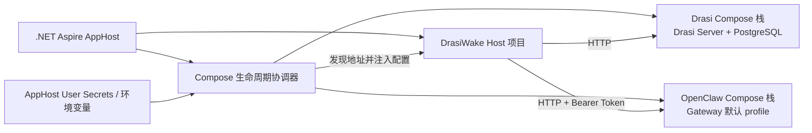

# DrasiWake Aspire 本地环境设计规格

- 日期：2026-10-03
- 状态：设计已获用户批准；文档复核待完成
- 范围：使用 .NET Aspire 编排本地 DrasiWake Host、Drasi Server 和 OpenClaw Gateway 开发/测试环境，并提供一套可复现的真实服务测试 fixture

## 1. 背景与目标

DrasiWake Bridge Core V1 是独立运行的 .NET Generic Host。开发和集成测试需要同时依赖 Drasi Server 与 OpenClaw Gateway。当前两项依赖分别由位于 DrasiWake 仓库之外的 Docker Compose 项目定义。

本设计新增一个 Aspire AppHost，为本地开发和测试提供统一的启动、依赖就绪、服务地址注入、状态观察和停止流程。两个外部 Compose 文件继续作为 Drasi 和 OpenClaw 服务定义的事实源；生产环境继续独立部署 Host，不依赖 AppHost。

目标：

- 一次启动本地 Host、Drasi Server/PostgreSQL 和 OpenClaw Gateway。
- 在依赖健康后才启动 Host，并将 Compose 实际发布的地址传给 Host。
- 安全地将 OpenClaw 必需密钥从 AppHost 配置传递给 Compose。
- 支持外部仓库路径配置，并提供适用于同级仓库布局的默认值。
- AppHost 退出时停止其启动的 Compose 服务，但保留持久化数据卷。
- 在 Docker、Compose、配置或端口冲突时提供不泄露密钥的诊断。

## 2. 范围与非目标

**范围**

- Aspire AppHost 是仅供本地开发和测试使用的入口。
- DrasiWake Host 作为 Aspire 项目资源运行。
- Drasi Server Compose 项目及其 PostgreSQL 依赖由原 Compose 文件管理。
- OpenClaw Gateway Compose 项目由原 Compose 文件管理。
- AppHost 管理外部 Compose 项目的启动、就绪等待、端口发现和关闭。

**非目标**

- 不改变生产部署形态或 Bridge Core 运行语义。
- 不复制或重新定义 Drasi/OpenClaw Compose 服务。
- 不修改外部 Drasi Server 或 OpenClaw Compose 文件及服务代码；fixture 配置与 MetaSkill 全部由 DrasiWake 仓库管理，通过 Compose override 和 workspace 路径覆盖注入。
- 不读取、复制、生成或提交 Drasi 仓库中的 `.env`。
- 不在初版启动 OpenClaw 的 `with-tls` Caddy profile。
- 不承诺 Docker 发布端口仅绑定本机回环地址；当前 Compose 端口绑定风险作为已知限制记录。
- 不把 Aspire 引入 Bridge Core 或生产 Host 的运行时依赖。

## 3. 架构

AppHost 包含 DrasiWake Host 项目资源，以及两个由 AppHost 生命周期协调器管理的 Compose 栈资源。协调器通过 Docker Compose CLI 调用各自仓库中的 `docker-compose.yml`，并以对应仓库根目录作为 Compose project directory。这样保留 Compose 文件中相对 build context、卷挂载、配置目录及环境文件的既有语义。



生命周期协调器必须承担成对的启动与清理责任。不能把 `docker compose up --detach` 当作一次性后台命令后就遗失资源所有权；应将每个 Compose 栈作为 AppHost 可观察、可清理的资源。具体 Aspire resource API 由实现时选定，但不可改变本规格的启动、失败回滚和停止语义。

## 4. 启动、发现与停止流程

### 4.1 启动前检查

在改变 Docker 状态前，AppHost：

1. 解析并验证 Drasi 与 OpenClaw 仓库目录，以及各自的 `docker-compose.yml`。
2. 验证 Docker CLI、Docker daemon 可用，并验证 Compose 支持 `up --wait`。
3. 验证必需密钥已配置，只报告缺少的配置项名称，不输出值。
4. 检查固定容器名及已知默认端口是否被其他运行实例占用。对端口占用的最终判断以 Compose 启动结果为准，因为 Drasi API 宿主机端口可由 Drasi 自己的 `.env` 覆盖，而 AppHost 不解析该文件。
5. 冲突时失败退出，不接管、不停止或清理冲突实例。

### 4.2 Compose 启动与健康门控

通过 Compose project directory 保持服务定义的相对路径和项目身份。两个 Compose 栈可并行启动：

```text
docker compose --project-directory <repository-root> -f <repository-root>/docker-compose.yml up --detach --wait
```

Compose 已定义健康检查：Drasi Server 的 HTTP `/health` 检查及 PostgreSQL 健康检查；OpenClaw Gateway 使用容器内 `--health-check`。Drasi Server 还声明等待 PostgreSQL 健康。AppHost 等待 Compose 报告服务健康后再启动 Host，不自行复制这些检查逻辑。默认不启用 OpenClaw 的 `with-tls` profile。

如果其中一个栈启动失败或健康等待超时，Host 不启动。协调器清理本次启动尝试产生的栈；不得执行 `down --volumes`。

### 4.3 Host 地址注入

依赖健康后，协调器查询实际映射端口：

- Drasi Compose 服务 `drasi-server` 的容器端口 `8080`。
- OpenClaw Compose 服务 `openclaw` 的容器端口 `18789`。

使用 `docker compose port` 的结果构造可由宿主机运行的 URI，并注入 Host 既有设置：

- `DrasiWake:Drasi:ServerUri`
- `DrasiWake:OpenClaw:BaseAddress`
- `DrasiWake:OpenClaw:BearerToken`

通配绑定地址应归一化为宿主机可连接的回环地址；具体地址解析规则及错误处理纳入自动化测试。若端口查询失败或结果含糊，Host 不启动，并清理本次启动的栈。AppHost 不从 Drasi `.env` 推导地址；Compose 自身照常按项目语义加载该文件。

### 4.4 停止

AppHost 先停止 DrasiWake Host，再对本次生命周期启动的 Compose 栈执行 `docker compose down`。停止命令不得带 `--volumes` 或 `-v`，以保留 Drasi 的 `drasi_postgres_data` 和 OpenClaw 的持久化 memory 卷。清理按启动逆序执行，某个栈清理失败不得阻止对另一个栈的清理；失败状态应在 AppHost 输出中可见。

## 5. 配置与密钥

所有开发环境设置进入 AppHost 配置，不扩展生产 Host 的部署配置来源。建议配置键：

| 配置键 | 用途 | 默认/处理 |
| --- | --- | --- |
| `DrasiWake:DevEnvironment:DrasiRepositoryPath` | Drasi Server 仓库路径 | 默认是 DrasiWake 仓库同级的 `drasi-server` |
| `DrasiWake:DevEnvironment:OpenClawRepositoryPath` | OpenClaw.NET 仓库路径 | 默认是 DrasiWake 仓库同级的 `openclaw.net` |
| `DrasiWake:DevEnvironment:OpenClaw:ModelProviderKey` | OpenClaw 模型提供方密钥 | 必需 secret；映射到 Compose 环境变量 `MODEL_PROVIDER_KEY` |
| `DrasiWake:DevEnvironment:OpenClaw:AuthToken` | OpenClaw Gateway 认证令牌 | 必需 secret；映射到 Compose 环境变量 `OPENCLAW_AUTH_TOKEN`，并用于 Host Bearer Token |

路径配置使用 AppHost 标准配置提供程序，可由 User Secrets、环境变量或本地开发配置覆盖。相对路径统一相对于 DrasiWake 仓库根目录解析，不依赖启动时的当前工作目录。路径缺省时使用上述同级目录默认值。

密钥由 AppHost User Secrets 或环境变量提供。协调器只将两个必需值作为子进程环境变量交给 OpenClaw Compose 调用；不将其拼入命令行参数、资源显示名、日志或错误文本。`MODEL_PROVIDER_KEY` 只传给 OpenClaw Compose；`OPENCLAW_AUTH_TOKEN` 同时用于 Gateway 容器与 Host 的 `DrasiWake:OpenClaw:BearerToken`。AppHost 不调用会把解析后完整 Compose 配置（含环境变量值）打印到日志的命令。

## 6. 冲突与故障处理

Compose 文件包含固定容器名及固定或可配置的宿主机端口，因此 AppHost 对所选本地服务栈实行独占管理：

- 已有固定名称容器或可识别的端口冲突时，启动前明确失败；不尝试复用或接管。
- `docker compose up --wait` 报告的端口冲突、构建失败或健康等待超时都阻止 Host 启动。
- 失败诊断包括服务名、仓库路径、失败阶段和可操作的下一步；不得包括 secret 值、完整环境转储或原始 Compose 配置输出。
- 清理只针对 AppHost 本次启动/启动尝试的 Compose project，不对预检发现的外部实例执行 `down`。
- `docker compose port` 无法得到唯一且有效的地址时视作配置/运行错误，不回退到静默猜测的默认端口。
- 缺失仓库、Compose 文件、Docker daemon、所需 Compose 能力或必需密钥时，在启动 Host 前失败。

现有两个 Compose 文件的端口映射未显式指定 `127.0.0.1`，Docker 可能将其发布到所有宿主机网卡。初版不改外部文件，开发者须将该环境视为可被本机网络访问的环境；若后续要求严格本机隔离，需单独批准 Compose 端口绑定调整。

## 7. 验证标准

### 自动化验证

使用可替换的 Docker/Compose 命令执行器覆盖：

- 默认仓库路径、绝对路径覆盖、相对路径以仓库根为基准解析，以及无效路径诊断。
- 缺失 Docker/Compose 能力、密钥缺失和容器/端口冲突时不会启动 Host。
- 两个栈执行 `up --wait` 后才启动 Host；两项依赖可并行启动。
- `docker compose port` 输出解析、通配地址归一化及无效/歧义输出的失败路径。
- Compose/健康检查/端口发现失败后回滚本次启动的栈，且不清理预先存在的资源。
- 正常关闭时 Host 先停止，Compose 使用不带 volume 删除参数的 `down`；秘密值不出现在参数或日志中。

### 本地端到端冒烟

在 Docker daemon、Drasi Server 仓库、OpenClaw.NET 仓库和本地密钥可用时，运行 AppHost 并确认：

1. Drasi/PostgreSQL 和 OpenClaw Gateway 达到各自健康状态后 Host 才启动。
2. Host 连接到 Compose 实际发布的 Drasi 与 Gateway 地址，并使用配置的 Gateway Bearer Token。
3. AppHost 退出后本次启动的容器停止，Drasi PostgreSQL 与 OpenClaw memory 数据卷仍存在。
4. 占用实例/端口和健康超时产生明确诊断，且不会停止冲突实例。

现有 Bridge Core 自动化测试继续作为回归门禁；它们不能代替真实 Compose 生命周期冒烟测试。真实运行需有效的本地 OpenClaw 模型密钥，但自动化测试不得要求提交或打印该密钥。

## 8. 实施前需验证的技术条件

以下是实现阶段必须验证的约束，不改变已批准的设计：

- 目标 .NET Aspire 版本提供适合管理自定义外部 Compose 生命周期的资源/生命周期扩展；若无现成导入支持，实现 AppHost 内部生命周期协调器，不复制 Compose 服务定义。
- 安装的 Docker Compose CLI 支持 `up --wait`，并能对两个 Compose 文件的健康检查语义正确等待。
- `docker compose port` 在目标 Windows/Docker Desktop 环境中返回可稳定解析的发布地址。
- 启停钩子在正常退出和启动中断时都能运行清理；异常中断后遗留的资源在下次启动时触发冲突诊断，不被误判为 AppHost 当前创建的资源。

本设计不指定具体 Aspire API 类型或包版本；这些选择应在实现计划前通过当前 SDK/包能力验证，并保持本规格的可观察行为和所有权约束。

## 9. 真实服务契约 Fixture

真实服务测试复用 Aspire AppHost 生命周期，并使用 Drasi Server examples 中的 mock `sensorReading` 数据形状。fixture 不依赖 PostgreSQL CDC、外部 webhook 或手工写入数据。

### 9.1 Drasi instance 与 query

在 `drasi-server/config/server.yaml` 配置一个单实例：

| 项目 | 标识/行为 |
| --- | --- |
| Drasi instance ID | `drasiwake-sensor-monitor` |
| Mock source ID | `sensor-mock`，`dataType.type: sensorReading`，自动启动 |
| Query ID | `sensor-readings`，自动启动 |
| Query 输出 | `SensorId`、`Temperature`、`Humidity`，字段沿用 `examples/configs/01-fundamentals/hello-world.yaml` |

配置文件位于 `dev/fixtures/drasi/config/server.yaml`。Drasi Compose override 位于 `dev/fixtures/drasi/compose.override.yml`，将该配置目录只读挂载到 `/app/config`；原 Drasi Compose 文件保持不变。Drasi query contract test 默认使用上述 instance/query ID，也允许 `DRASIWAKE_REAL_DRASI_INSTANCE_ID` 和 `DRASIWAKE_REAL_DRASI_QUERY_ID` 覆盖。

### 9.2 OpenClaw MetaSkill

在 `dev/fixtures/openclaw/workspace/skills/drasiwake-sensor-reading-summary/SKILL.md` 增加 `drasiwake-sensor-reading-summary` MetaSkill。Aspire 通过 `OPENCLAW_WORKSPACE` 令 OpenClaw Compose 使用此 workspace。它接收 query 事件 JSON，以一个 `llm_chat` composition step 生成简短摘要；仅陈述输入中有依据的传感器 ID、温度和湿度，不引入未配置的阈值或处置动作。该 skill 不调用外部工具、不写入数据。

Gateway contract test 默认指定该 skill，并发送固定的传感器事件作为输入；仍允许 `DRASIWAKE_REAL_GATEWAY_TEST_SKILL` 覆盖。测试继续以并发重复请求验证同一幂等键只对应同一个 invocation ID。该 opt-in Gateway 测试最多触发一次模型生成，可能产生模型服务费用。

### 9.3 Aspire smoke 与凭据

`DRASIWAKE_RUN_REAL_ASPIRE_SMOKE=1` 单独启用真实启动 smoke：启动共享 Aspire fixture，确认 Drasi 和 OpenClaw 均通过 Compose 健康门控并发现宿主机地址，然后通过 Aspire 生命周期清理本次栈。该 smoke 不调用模型。

模型配置优先级为显式 `DrasiWake:DevEnvironment:OpenClaw:*`、`MODEL_PROVIDER_KEY` / `MODEL_PROVIDER_ENDPOINT` / `MODEL_PROVIDER_MODEL`、兼容 fallback `LLM_API_KEY` / `LLM_BASE_URL` / `LLM_MODEL_NAME`。模型 provider key 与 Gateway `AuthToken` 是不同用途的凭据；真实启动必须分别提供。smoke 可使用仅限测试进程的临时 Gateway token，不持久化或写入仓库。

仅在显式 opt-in 时启动真实 Compose。未设置 smoke 或契约测试运行开关时，测试必须跳过且不启动 Docker。外部 Compose 定义保持不变；所有 Drasi 配置、Compose override 和 OpenClaw workspace skill 都位于 DrasiWake 仓库的 `dev/fixtures` 下。
